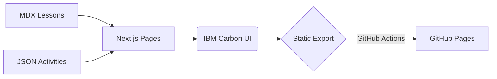

# Skunkworks AZ‑400 DevOps Accelerator

<!-- Banner (SVG below in /AZ-400/assets) -->
<p align="center">
  
</p>

<p align="center">
  <a href="https://skunkworks-academy.github.io/Microsoft/AZ-400/"></a>
  
  
  
  
  
</p>

> **Enterprise-ready, hands‑on learning path for AZ‑400**. Build real CI/CD pipelines using Azure DevOps and GitHub Actions with production‑grade practices, accessible on desktop and mobile.

---

## 🎯 Course Overview

**Skunkworks AZ‑400 DevOps Accelerator** is a self‑paced, instructor‑supported program that combines theory, live demos, and labs. The course is structured into **3 modules**, each with escalating **6 levels** (Foundations → Capstone). Learners earn XP and badges as they progress.

- **Audience:** Devs, SREs, QA, Platform & Release Engineers
- **Prereqs:** Basic Git, Node/JS familiarity, Azure subscription access (or free trial)
- **Outcomes:**
  - Design and implement CI/CD pipelines on Azure DevOps & GitHub Actions
  - Integrate testing, quality gates, and security scanning
  - Release safely with blue/green, canary, and approvals
  - Instrument pipelines for reliability, cost, and speed

---

## 🧭 Curriculum (Modules & Levels)

> Each level contains: lesson, interactive activities, and a hands‑on lab.

| Module | Focus | Levels |
|---|---|---|
| **1** | CI/CD Foundations | Foundations • Comprehension • Application • Analysis • Evaluation • Capstone |
| **2** | Environments & Release | Foundations • Comprehension • Application • Analysis • Evaluation • Capstone |
| **3** | Observability & Governance | Foundations • Comprehension • Application • Analysis • Evaluation • Capstone |

<details>
<summary><strong>Detailed Outline</strong></summary>

### Module 1 — CI/CD Foundations
- **Foundations:** CI basics, branch strategies, runners/agents
- **Comprehension:** Test pyramid, caching, artifacts, packages
- **Application:** GitHub Actions / Azure Pipelines build
- **Analysis:** Flakiness, parallelism, matrix builds
- **Evaluation:** Quality gates (lint, coverage, SAST)
- **Capstone:** Full CI pipeline with caching + tests + artifacts

### Module 2 — Environments & Release
- **Foundations:** Deploy targets, infra as code basics
- **Comprehension:** Environments, approvals, secrets
- **Application:** Blue/green & canary with gates
- **Analysis:** Rollback strategies, feature flags
- **Evaluation:** Change failure rate, MTTR, DORA
- **Capstone:** Multi‑stage CD with approvals and targeted rollouts

### Module 3 — Observability & Governance
- **Foundations:** Logs, metrics, traces for pipelines and apps
- **Comprehension:** Dashboards, alerts, SLIs/SLOs
- **Application:** Cost & performance guardrails
- **Analysis:** Compliance, artifact provenance, SBOM
- **Evaluation:** Policy as code (OPA/GitHub rulesets)
- **Capstone:** Governance dashboard + policy‑enforced release

</details>

---

## 🧪 Labs (Hands‑On)

- **Lab 1.1:** Create CI with tests & cache (GitHub Actions or Azure Pipelines)
- **Lab 1.3:** Publish artifacts & SBOM
- **Lab 2.2:** Staged deployments with approvals
- **Lab 2.4:** Canary rollout + feature flags
- **Lab 3.1:** Instrument CI/CD metrics (duration, success rate)
- **Lab 3.5:** Policy as code enforcing quality gates

> See `/AZ-400/labs` and in‑app level pages for exact steps.

---

## 🚀 Getting Started (Dev)

```bash
# from repo root
cd AZ-400/web
npm i
npm run dev
# open http://localhost:3000/course
```

**Production (GitHub Pages):** a workflow (see below) builds static HTML with `DEPLOY_TARGET=gh-pages` so the site serves under `/Microsoft/AZ-400`.

---

## 📦 Tech Stack

- **Next.js 15 (App Router)** + **React 18** + **TypeScript**
- **IBM Carbon Design System** (responsive, accessible)
- **MDX** content, **Zustand** client state
- **Playwright** e2e, **Vitest** unit testing



---

## 📈 Roadmap

- [ ] Replace placeholder content with client‑approved syllabus
- [ ] Add Leaderboard (Supabase adapter)
- [ ] Accessibility audit against WCAG 2.2 AA
- [ ] Add scenario & comparator widgets

---

## 💼 Commercials

| Package | Duration | Format | Price | Notes |
|---|---:|---|---:|---|
| **Self‑paced** | 2–4 weeks | Asynchronous | $X per learner | Includes forum support, updates |
| **Cohort (virtual)** | 3 days | Live + labs | $X per learner | Min 15 learners, live Q&A |
| **Enterprise onsite** | 2–3 days | Onsite workshop | $X/day | Custom labs, NDA option |

> Volume discounts available. Contact: **hello@skunkworksacademy.com**

---

## 📚 Resources

- Course site: `/Microsoft/AZ-400/`
- Labs: `/AZ-400/labs/`
- Support: Issues tab or email above

---

## 🔧 GitHub Pages Deploy (CI)

```yaml
# .github/workflows/az400-pages.yml
name: Deploy AZ-400 Site
on:
  push:
    branches: [ main ]
    paths: [ 'AZ-400/**', '.github/workflows/az400-pages.yml' ]
permissions:
  contents: read
  pages: write
  id-token: write
jobs:
  build-deploy:
    runs-on: ubuntu-latest
    env:
      DEPLOY_TARGET: gh-pages
    steps:
      - uses: actions/checkout@v4
      - uses: actions/setup-node@v4
        with: { node-version: 20, cache: npm }
      - name: Install
        run: npm ci
        working-directory: AZ-400/web
      - name: Build
        run: npm run build
        working-directory: AZ-400/web
      - uses: actions/upload-pages-artifact@v3
        with: { path: AZ-400/web/out }
      - uses: actions/deploy-pages@v4
```

---

## 🖼️ SVG Assets (drop in `./AZ-400/assets`)

> These are lightweight, brand‑aligned SVGs you can customize. Save each as a file under `AZ-400/assets/` and the README will render them.

### 1) `course-banner.svg`
```svg
<svg xmlns="http://www.w3.org/2000/svg" width="1200" height="360" viewBox="0 0 1200 360" role="img" aria-labelledby="title desc">
  <title id="title">Skunkworks AZ-400 DevOps Accelerator</title>
  <desc id="desc">Course banner with gradient and CI/CD iconography</desc>
  <defs>
    <linearGradient id="g" x1="0" x2="1">
      <stop offset="0%" stop-color="#0ea5e9"/>
      <stop offset="100%" stop-color="#111827"/>
    </linearGradient>
  </defs>
  <rect width="1200" height="360" fill="url(#g)"/>
  <g fill="#fff" opacity="0.08">
    <circle cx="80" cy="300" r="120"/>
    <circle cx="1140" cy="60" r="80"/>
    <path d="M100 120h200v40H100zM100 180h260v20H100zM100 220h170v20H100z" />
  </g>
  <g fill="#fff">
    <text x="80" y="140" font-family="Segoe UI, Roboto, Arial" font-size="44" font-weight="700">Skunkworks AZ‑400</text>
    <text x="80" y="190" font-family="Segoe UI, Roboto, Arial" font-size="28" opacity="0.95">DevOps Accelerator — Azure DevOps · GitHub Actions · CI/CD</text>
  </g>
  <g transform="translate(930,120)">
    <circle cx="60" cy="60" r="58" fill="#0ea5e9" opacity="0.2"/>
    <path fill="#fff" d="M30 60a30 30 0 1 0 60 0a30 30 0 1 0 -60 0zm12-2h36v4H42v18h-4V58z"/>
  </g>
</svg>
```

### 2) `module-badges.svg`
```svg
<svg xmlns="http://www.w3.org/2000/svg" width="900" height="120" viewBox="0 0 900 120" role="img" aria-label="Module badges">
  <defs>
    <linearGradient id="b1" x1="0" x2="1"><stop offset="0%" stop-color="#0ea5e9"/><stop offset="100%" stop-color="#38bdf8"/></linearGradient>
    <linearGradient id="b2" x1="0" x2="1"><stop offset="0%" stop-color="#111827"/><stop offset="100%" stop-color="#4b5563"/></linearGradient>
  </defs>
  <g font-family="Segoe UI, Roboto, Arial" font-size="16" fill="#fff">
    <rect x="20"  y="20" rx="12" ry="12" width="260" height="80" fill="url(#b1)"/>
    <text x="150" y="70" text-anchor="middle">Module 1 · CI/CD Foundations</text>
    <rect x="320" y="20" rx="12" ry="12" width="260" height="80" fill="url(#b2)"/>
    <text x="450" y="70" text-anchor="middle">Module 2 · Environments & Release</text>
    <rect x="620" y="20" rx="12" ry="12" width="260" height="80" fill="url(#b1)"/>
    <text x="750" y="70" text-anchor="middle">Module 3 · Observability & Governance</text>
  </g>
</svg>
```

### 3) `agenda-timeline.svg`
```svg
<svg xmlns="http://www.w3.org/2000/svg" width="900" height="200" viewBox="0 0 900 200" role="img" aria-label="Course timeline">
  <g stroke="#0ea5e9" stroke-width="4" fill="none">
    <line x1="60" y1="100" x2="840" y2="100" />
  </g>
  <g fill="#0ea5e9">
    <circle cx="120" cy="100" r="10"/><circle cx="330" cy="100" r="10"/>
    <circle cx="540" cy="100" r="10"/><circle cx="750" cy="100" r="10"/>
  </g>
  <g font-family="Segoe UI, Roboto, Arial" font-size="14" fill="#111827">
    <text x="120" y="70" text-anchor="middle">Kickoff</text>
    <text x="330" y="70" text-anchor="middle">Module 1</text>
    <text x="540" y="70" text-anchor="middle">Module 2</text>
    <text x="750" y="70" text-anchor="middle">Module 3 & Capstone</text>
  </g>
</svg>
```

---

## ✍️ Contributing

Issues and PRs welcome. Please include screenshots or a brief Loom for UI changes.

---

© Skunkworks Academy. All rights reserved.

